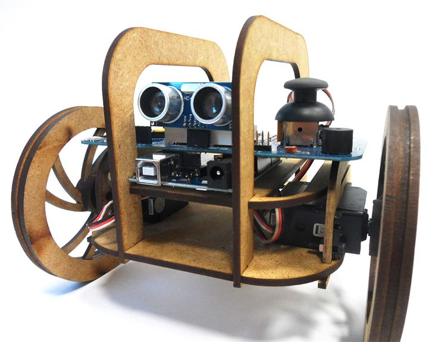
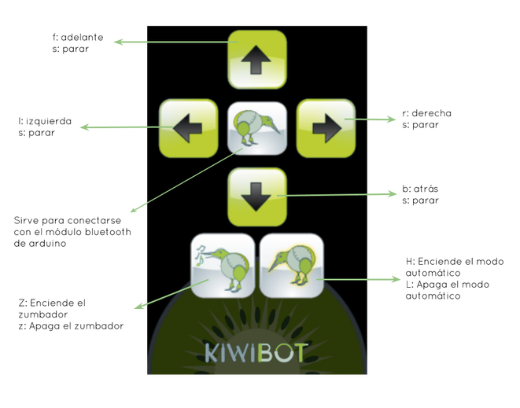

# LaserBot
Es un vehiculo móvil que usa el escudo KiwiBot y un chasis fabricado con cortadora láser diseñado por fablab Sevilla en colaboración con Jose Pujol

El chásis lo podemos encontrar en Thingiverse https://www.thingiverse.com/thing:1216952

En el repositorio podemos encontrar:
- App en formato nativo .aia y en formato ejecutable para controlarlo via Bluetooth
- Código de Arduino con 2 modos de funcionamiento: Manual (App) y Automático (sensor distancia)

